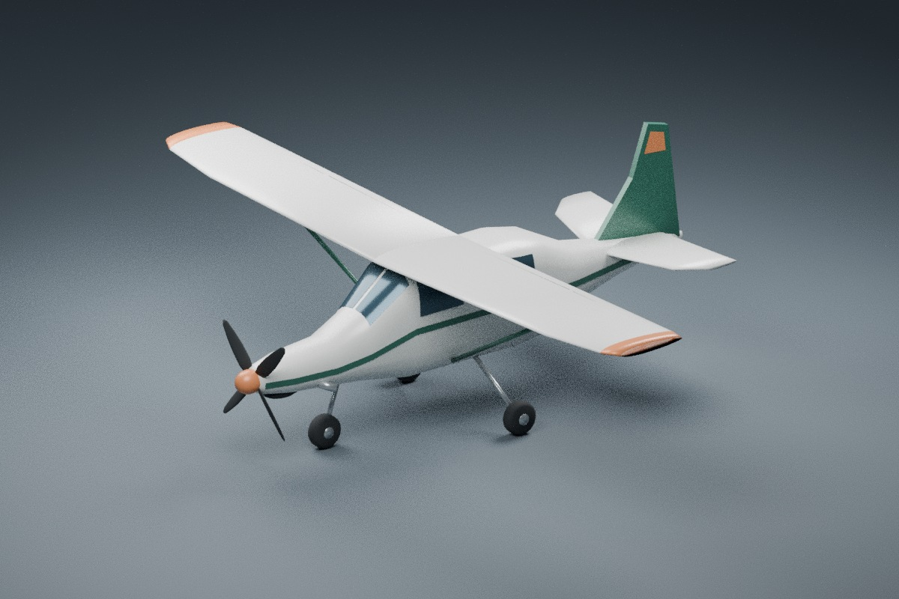
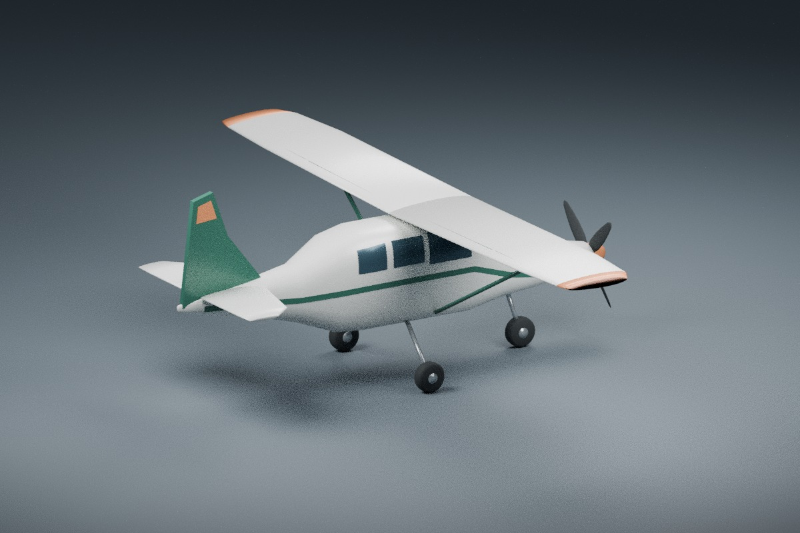
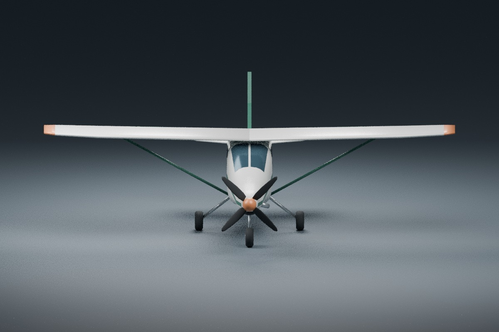

# Cedar Utility Turboprop (experimental): isolated visual asset

Cedar is an original single-engine, high-wing utility aircraft exterior with a
four-blade propeller and fixed tricycle gear. This is a presentation foundation,
not a selectable aircraft, a qualified physical preset, certified data, or a
representation of a named real aircraft. There is no new app profile, picker
entry, physical model, replay integration, audio binding or publication here.

The compact asset lives under `assets/aircraft/experimental/` until the new
physical family, profile identity, replay and native presentation pass their
separate qualification. Existing Light Single, Swift, Meadow and Kestrel files
and all distribution allowlists remain byte-for-byte unchanged.

## Deliverables and provenance

- [Original Blender generator](../../tools/blender/build_cedar_turboprop.py)
- [Editable source](../../assets/aircraft/experimental/cedar_turboprop_experimental.blend)
- [Self-contained GLB](../../assets/aircraft/experimental/cedar_turboprop_experimental.glb)
- [Binary validator](../../tools/blender/validate_cedar_turboprop.py)
- [Blender source/import audit](../../tools/blender/audit_cedar_blender.py)
- [Machine-readable source/license record](cedar-turboprop-provenance.json)

Created on 2026-10-04 with the existing Blender 4.3.2 installation. Geometry,
materials, colors, dimensions and studio setup are defined in the generator.
Shared mesh construction, axis conversion and deterministic export utilities are
adapted from this repository's original Meadow Trainer generator. The utility
cabin, cowl, wings, tail, wheels, four twisted blade meshes and color arrangement
are authored for Cedar. There are no downloaded meshes, textures, blueprint
measurements, manufacturer marks, generated-image services or paid services.
The name is provisional, and no trademark clearance is implied.

The original generator, geometry/material output, editable scene, previews and
validation tools use this repository's [MIT](../../LICENSE-MIT) OR
[Apache-2.0](../../LICENSE-APACHE) license. This is the authorship record for these
new files; it does not change existing asset terms or constitute commercial
release approval. Blender's application license is not used to infer artwork
rights. The dedicated provenance record deliberately does not expand either
release asset allowlist.

## Authored visual contract

Dimensions are original visual proposals. A future qualified profile must either
adopt and test them or deliberately revise the new asset; they are not FDM inputs
by implication.

| Quantity | Proposed value |
| --- | --- |
| Wingspan | 12.6 m |
| Nose-to-tail extent | 9.6 m, body forward -5.7 to +3.9 m |
| Overall height | 4.25 m, up -1.60 to +2.65 m |
| Scene origin / proposed CG | body (0, 0, 0) m |
| Nose contact | body (2.0, 0, 1.60) m |
| Port main contact | body (-1.0, -1.55, 1.60) m |
| Starboard main contact | body (-1.0, 1.55, 1.60) m |
| Proposed cockpit eye | body (0.65, -0.28, -1.0) m |
| Shaft axis and propeller station | body +X through CG; (3.52, 0, 0) m |
| Propeller design disk | 2.4 m diameter; all blade vertices contained within it |
| Static blade reference | 20 degrees at 75% radius, 0.9 m |
| Design disk clearance to flat tyre-contact plane | 0.40 m at every shaft phase, level and uncompressed |

The contact plane was lowered 0.25 m relative to the first visual draft, extending
only the original three gear struts and moving each tyre/hub down by the same
amount. This increases the nominal level, uncompressed disk clearance from
0.15 to 0.40 m without changing the fuselage, CG or propeller. It is a visual
clearance design target. Suspension sag/travel, tyre deflection, braking-induced
nose-down pitch, dynamic touchdown and uneven/sloped ground remain unqualified.
A future physical profile must prove sufficient clearance in its actual states;
this nominal margin is not a bound on those motions.

Body coordinates are forward/right/down. Generator coordinates are
forward/right/up, mapped to Blender (-right, -forward, up). Exported GLB is
+Y up, +Z nose and -X starboard. Thus GLB (x, y, z) maps to body (z, -x, -y).
The future adapter proposal is `forward: "+z"`, `up: "+y"`, `length_m: 9.6`.
Measured fit scale is 1.0000000099341075, unity to float32 precision. The asset
origin is the declared CG, not its bounding-box midpoint; no old model is rotated.
Port lenses are red at positive GLB X; starboard lenses are green at negative X.
The proposed eye is GLB (0.28, 1.0, 0.65) m and lies inside the cabin shell. There
is no embedded camera or qualified cockpit view. Windows are opaque exterior
panes; a later cockpit integration must choose and test its visibility strategy.

Every GLB node has an identity transform. One stable empty node named
`Cedar propeller assembly` parents the spinner and four individually named blades.
Its pivot is the CG on the same shaft line; rotation around local +GLB Z would
therefore rotate the assembly about body +X without moving the airframe. This is
only a stable grouping for future presentation work, with no animation, shaft
speed, governor or blade-pitch binding. Blade pitch is built into the meshes;
future variable-pitch geometry requires a separately reviewed presentation change.
The mesh's positive right-hand body-X sense is clockwise looking forward.

Flaps, ailerons, elevator and rudder have neutral visual deflection. This is not
an aerodynamic trim solution. Propeller phase, wheels and gear compression are
static; navigation lenses do not add active lights. Intake and exhaust are
illustrative nacelle details, not additional physical engines or exhaust thrust.

## Rebuild and verify

From the repository root, using Blender 4.3.2 and Python 3:

```sh
blender --background --disable-autoexec --threads 2 --python-exit-code 1 \
  --python tools/blender/build_cedar_turboprop.py
python tools/blender/validate_cedar_turboprop.py
blender --background --disable-autoexec --threads 2 --python-exit-code 1 \
  --python tools/blender/audit_cedar_blender.py
```

The generator starts from an empty scene. Optional arguments after `--` are
`ASSET_DIRECTORY PREVIEW_DIRECTORY [--no-render]`. For an independent rebuild:

```sh
blender --background --disable-autoexec --threads 2 --python-exit-code 1 \
  --python tools/blender/build_cedar_turboprop.py -- \
  /tmp/cedar-rebuild/assets /tmp/cedar-rebuild/previews --no-render
cmp assets/aircraft/experimental/cedar_turboprop_experimental.glb \
  /tmp/cedar-rebuild/assets/cedar_turboprop_experimental.glb
```

Separate Blender processes produced byte-identical GLBs. The export canonicalizes
triangle ordering and embedded buffer packing without changing winding, vertices,
normals or materials. Unused UV coordinates are omitted. `.blend` container bytes
and render noise need not be identical across processes, Blender versions or
platforms; the exact source scene is supplied, and the generator is the documented
rebuild path. No `.blend` scripts, linked libraries or external images are used.
Studio ground, one camera and three lights are in a separate collection and are
excluded from GLB export.

## Evidence and limits

[Binary evidence](../qa/cedar-turboprop-asset-validation.json) checks GLB chunks,
embedded buffers, all resource/script/extension fields, finite attributes,
normalized normals, accessor bounds, valid indices, nondegenerate triangles,
identity node transforms, complete scene hierarchy, budget, proposed contacts,
CG/eye containment, red/green sides, shaft geometry and measured 20-degree pitch
at every blade's 75% radius. Old model/profile/generator and release-manifest
hashes remain exact. The [Blender audit](../qa/cedar-turboprop-blender-audit.json)
checks the actual source scene, imports the final GLB into an empty scene, and
compares all source/imported world vertices in both directions within 0.00003 m.
Both passed, as did Python syntax compilation and the separate-process rebuild.
The [clearance delta audit](../qa/cedar-turboprop-clearance-delta.json) compares
the previous and corrected GLBs: exactly nine gear meshes changed; the other
35 mesh attribute/index/material records are exact. Tyres and hubs translate
down 0.25 m, with unchanged normals, indices and materials. All eight materials
and the mesh/triangle/vertex budgets are unchanged.

| Exported budget | Cedar | Meadow ceiling |
| --- | ---: | ---: |
| GLB bytes | 97,404 | 140,864 |
| Meshes / triangle primitives | 44 / 44 | 46 / 46 |
| Exported vertices | 2,422 | 3,759 |
| Triangles | 4,380 | 5,756 |
| Materials | 8 | 8 |
| Texture / image / external resource | 0 / 0 / 0 | 0 / 0 / 0 |

There are 45 nodes: 44 mesh nodes and the single empty propeller grouping.
These are static asset counts, not frame-time, GPU-memory or FPS measurements.
No Cargo, Bevy, FlightSim native or desktop lane was used. Physical/replay profile
qualification, runtime presentation, camera visibility, actual motion, audio,
manual handling, Windows/GPU and release checks remain separate work.

The following are actual neutral Cycles CPU previews at 1200×800, 32 samples and
no denoising. The previews were regenerated after the gear-clearance correction
and visually inspected by the asset author. They are Blender asset previews, not
simulator screenshots. The source/import audit confirms the same world vertices
in the delivered GLB.




