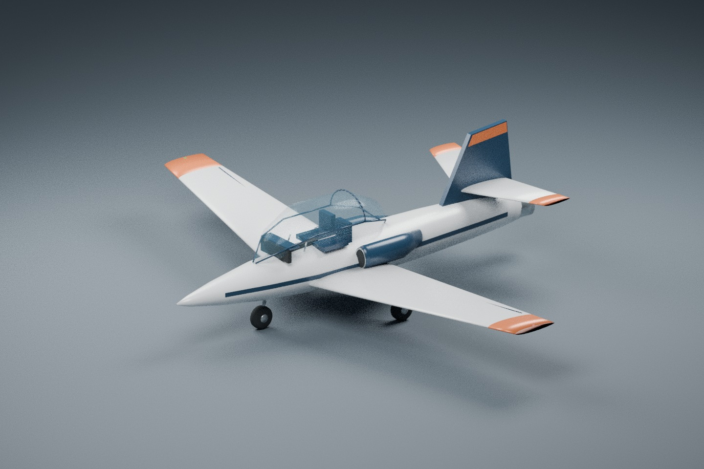
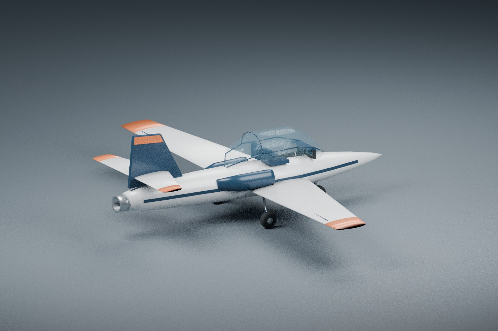
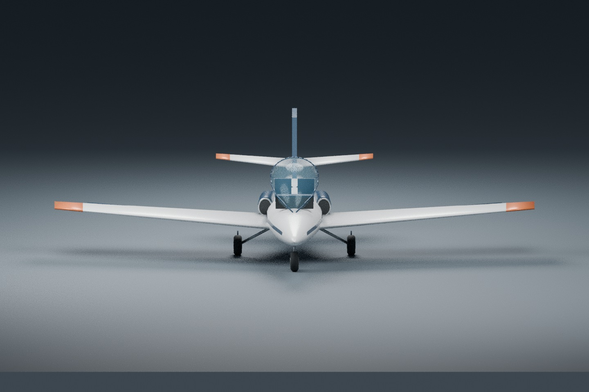
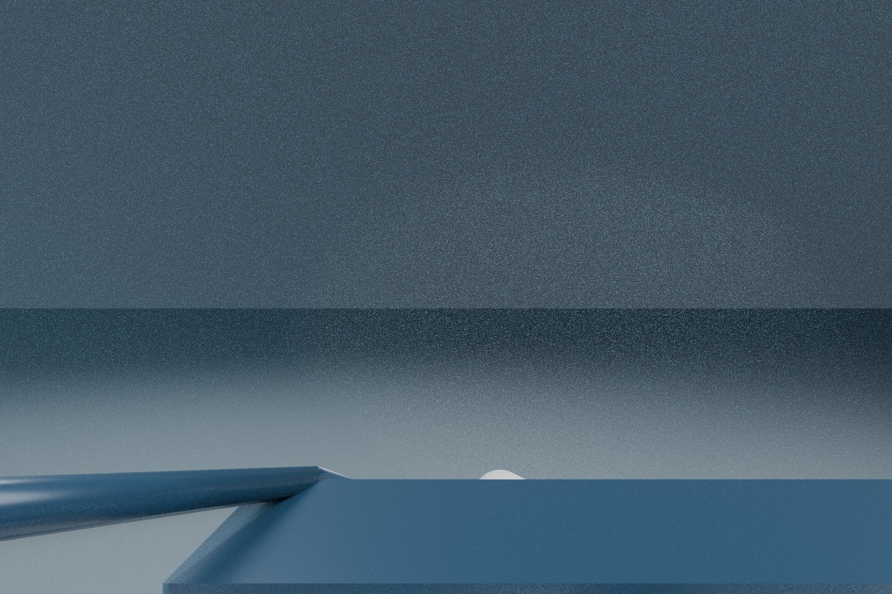

# Kestrel Jet Trainer: original fictional dry-jet development aircraft

Kestrel Jet Trainer is an original low-wing, fixed-tricycle-gear, modest-speed
fictional light jet. The model has cheek intakes, one dry exhaust, a clear bubble
canopy, two simple seats, a panel and a navy/copper/porcelain paint scheme. No
part represents a particular manufacturer's aircraft. No weapon, afterburner,
fuel system, spool dynamics, retractable gear or certified training fidelity is
implied.

The supplied version-2 profile is a **provisional authored development profile**.
Its initial 1043 kg mass, inertia, 11 m span, 16.17 m² area, gear and all 25
low-speed aerodynamic coefficients are inherited from the repository's separate
synthetic numerical fixture. They are uncalibrated assumptions, not measured
real-jet derivatives or properties inferred from this mesh. The fixture remains
byte-for-byte unchanged. The new ID is `kestrel-jet-trainer`; model metadata and
sound do not select the physics law. The profile explicitly selects
`dry_jet_table` revision 1.

## Source, scope and license

- [Procedural Blender source](../../tools/blender/build_kestrel_jet_trainer.py)
- [Editable Blender scene](../../assets/aircraft/kestrel_jet_trainer.blend)
- [Embedded-only GLB](../../assets/aircraft/kestrel_jet_trainer.glb)
- [External profile](../../assets/aircraft/kestrel_jet_trainer.json)
- [Initial profile generator](../../tools/blender/build_kestrel_jet_profile.py)
- [Binary/schema contract validator](../../tools/blender/validate_kestrel_jet_trainer.py)

Created on 2026-10-04 with installed Blender 4.3.2 using newly written procedural
geometry and material definitions. Mesh construction/export utilities follow the
project's original Meadow authoring workflow. No imported model, paid asset,
Meshy output, photo, texture, logo, blueprint or proprietary aircraft dataset is
used. Material colors and shapes are directly authored; the GLB has no external
buffer, image, texture, resource URL, animation or skin dependency.

The new generator, its original geometry/material output, profile, validator,
documentation and previews use the project's MIT OR Apache-2.0 license; see
[MIT](../../LICENSE-MIT) and [Apache-2.0](../../LICENSE-APACHE). This provenance
records original authorship and the chosen project license. It is not a claim of
trademark clearance, certification, publication or commercial-release approval.
Existing models/profiles and their terms are untouched. No commercial candidate
allowlist or built-in aircraft count is changed by these asset-only files.

## Coordinate, contact and eye contract

The scene origin is the intended physical CG in metres, with identity transforms
on every exported mesh node. ModelFit must preserve that origin and must not
recenter from the bounding box. GLB forward is +Z and up is +Y, so
`GLB (x,y,z) → body (z,-x,-y)`. Authoring uses forward/right/up and maps into
Blender `(-right,-forward,up)` before glTF export.

Measured GLB forward extent is exactly 8.5 m (float32 bounds −4.8499999046 to
+3.6500000954); profile `length_m: 8.5` therefore gives exact unit ModelFit scale.
Visual span is 11 m. Main-wing root/tip chords 1.99/0.95 m form a trapezoidal
16.17 m² nominal planform before the thin decorative tip sleeves, including
the area through the fuselage. Airfoil, tail and
volume geometry are illustrative; no aerodynamic calibration is inferred.

| Tyre bottom centre | Body forward/right/down, metres |
| --- | --- |
| Nose | 1.6 / 0 / 1.0 |
| Port main | −0.8 / −1.3 / 1.0 |
| Starboard main | −0.8 / 1.3 / 1.0 |

Contacts refer to the lowest tyre centreline points, not wheel hubs. The tyres
are static and do not animate suspension compression. Port red is GLB +X;
starboard green is GLB −X. Navigation lenses are colored geometry, with no new
runtime lighting system.

The eye is body `(0.6,-0.25,-0.9)`, GLB `(0.25,0.9,0.6)`. It lies inside the
transparent canopy. The validator measures clearance to every opaque exported
triangle and checks forward, ±26.6° horizontal and ±10.2° vertical sightlines.
The exterior contains simple static interior furnishings. The opt-in native jet
path keeps this GLB visible in cockpit mode and omits the unrelated legacy
procedural interior. Native material/camera/UI acceptance remains a separate
check; the Blender eye preview alone does not establish simulator behavior.

## Explicit synthetic thrust and envelope

The aggregate installed net-thrust table uses pressure ratios `[0,1,1.10]`,
temperature ratios `[0.65,1,1.20]` and Mach `[0,0.35]`, in pressure/temperature/Mach
order with Mach fastest. Each knot is authored from:

- idle thrust = `100 × pressure × (1 − 0.4 × Mach) / sqrt(temperature)` N
- maximum dry thrust = `2500 × pressure × (1 − 0.12 × Mach) / sqrt(temperature)` N

These formulas are a synthetic development choice, not an engine-performance
source. The runtime interpolates the stored knots trilinearly; it does not
evaluate the nonlinear temperature formula between knots. Exact pressure=1,
temperature=1 and Mach=0 knots give exactly +100 N idle and +2500 N maximum dry
thrust. Vacuum knots are exactly zero, all other authored idle values are
nonnegative and maximum dry thrust exceeds idle. Thrust is aggregate, acts
through the CG and has no engine-count multiplier or added ram correction.

The explicit operating box is pressure ratio `[0.35,1.08]`, temperature ratio
`[0.65,1.20]`, Mach `[0,0.35]`. This modest subsonic bound is a numerical support
box, not an approved altitude/speed/weather envelope. Runtime rejection outside
it must remain visible and transactional. The Mach schedule repeats the inherited
low-speed coefficients at 0 and 0.35; it makes no transonic fidelity claim.

Controls, default trim and approach metadata initially match the numerical
fixture and remain provisional. Headless checks and bounded actual manual flight
checks now exist in [native development QA](../qa/kestrel-native-flight-2026-10-04.md).
They do not calibrate the inherited coefficients or establish trim throughout the
operating box. A changed thrust table must be checked again; schema and asset
validation alone do not establish acceptable handling.

## Rebuild and verification

From the repository root:

```sh
blender --background --threads 2 --python tools/blender/build_kestrel_jet_trainer.py
python3 tools/blender/build_kestrel_jet_profile.py
python3 tools/blender/validate_kestrel_jet_trainer.py
```

The first command exports the GLB, saves an editable scene with a separate studio
collection and renders four actual Blender Cycles CPU previews at 1440×960,
40 samples with denoising disabled. Optional arguments after `--` select output
asset/preview directories; `--no-render` skips previews. It never exports the
studio ground, camera or lights. The profile generator overwrites only the new
Kestrel profile with the documented initial assumptions: review before rerunning
after any manual calibration.

The pure-Python validator requires `jsonschema` and directly inspects binary
accessors, triangle indices, positions, normals, bounds and material colors. It
checks embedded-only resources, nondegenerate triangles, identity nodes, exact
scale, all three contacts, eye/CG containment, eye clearance, sightlines, nav
sides, static thrust reference, schema, original-file hashes and arbitrary
attitude/contact transforms under two large-ECEF origins. Those independent
coordinate checks are not execution of the native app's renderer. Exact-numeric
Rust loader/headless acceptance and native/GPU handling remain separate.

A separate Blender 4.3.2 export produced a byte-identical GLB, and Blender
successfully re-imported the canonical file as 53 mesh objects. The four final
preview images were inspected by the author. Full exported counts, bounds,
contact/eye evidence, SHA-256 preservation and preview hashes are in [asset validation](../qa/kestrel-jet-trainer-asset-validation.json).






These are Blender asset QA images, not simulator screenshots. No native flight,
frame-rate benchmark, release readiness or commercial packaging is claimed here.
