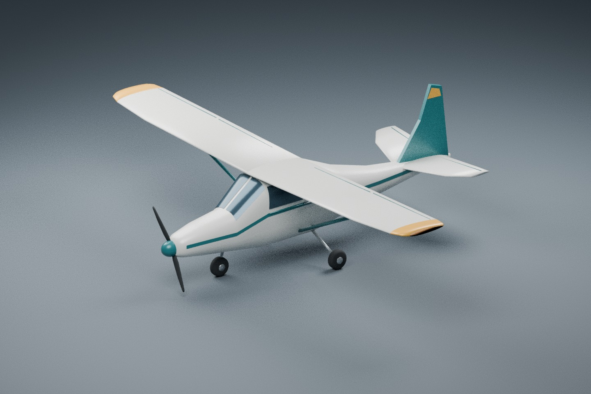
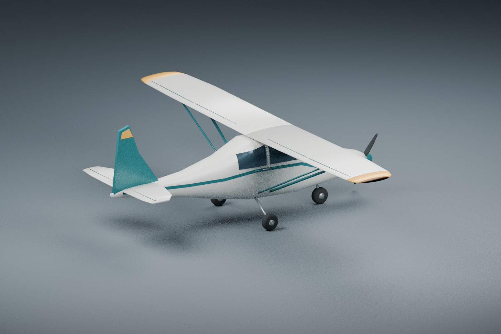
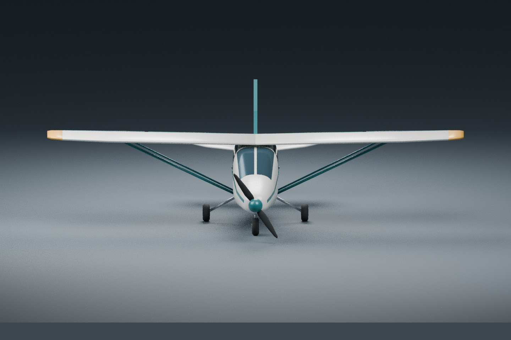

# Meadow Trainer: original high-wing exterior and reusable profile

Meadow Trainer is an original, generic high-wing, fixed-tricycle-gear visual asset.
It adds an external JSON profile that uses **all Light Single numeric dynamics and
controls unchanged**. Only the profile identifier, display name, exterior model
adapter and default piston sound differ. The cockpit eye remains the established
Light Single location. This is a new exterior choice, not a newly calibrated or
certified flight model, or a representation of a particular real aircraft.

## Use the existing external-profile entry point

From the repository root, with an ordinary development build:

```sh
BEVY_ASSET_ROOT="$PWD" target/release/flightsim-app \
  --aircraft assets/aircraft/meadow_trainer.json --view chase
```

`--aircraft` is a filesystem path here. `meadow-trainer` is the identifier inside
the file; it is **not** a new built-in selection and does not appear in
`--list-aircraft`. `model.path` is `aircraft/meadow_trainer.glb`, relative to the
application's resolved `assets/` root, not to the profile directory. Setting
`BEVY_ASSET_ROOT` to this checkout root avoids selecting an older executable's
assets when several worktrees coexist. For PowerShell, set
`$env:BEVY_ASSET_ROOT = (Get-Location).Path` before the equivalent command.

The assets remain outside the commercial candidate allowlist. A commercial-staging
build uses its adjacent, audited assets; this external profile does not bypass or
expand that policy. This change does not authorize packaging or publication.

## Editable source and provenance

- [Procedural Blender generator](../../tools/blender/build_meadow_trainer.py)
- [Editable Blender scene](../../assets/aircraft/meadow_trainer.blend), with separate
  aircraft and studio collections
- [Self-contained GLB](../../assets/aircraft/meadow_trainer.glb)
- [External profile](../../assets/aircraft/meadow_trainer.json)
- [Asset validator](../../tools/blender/validate_meadow_trainer.py)

Authored for this project on 2026-10-04 using the already installed Blender 4.3.2.
Geometry, shapes, colors and studio lighting are defined directly in the generator.
No downloaded model, Meshy output, texture, blueprint, logo or brand is used.
The numeric gear contacts, span and camera eye are derived from this repository's
Light Single JSON, not from a newly imported aircraft data set. Paint bands,
window panes and navigation lenses are mesh/material geometry; the GLB contains
no images, textures, external buffers or resource URLs.

The original generator, its original geometry/material output, previews and
profile use the repository's MIT OR Apache-2.0 license (see
[MIT](../../LICENSE-MIT) and [Apache-2.0](../../LICENSE-APACHE)). This provenance
statement covers how these new files were made; it is not third-party rights
clearance, a trademark clearance, or commercial release approval. The existing
Light Single and Swift Sport files and their terms remain unchanged.

Rebuild from the repository root:

```sh
blender --background --threads 2 --python tools/blender/build_meadow_trainer.py
python tools/blender/validate_meadow_trainer.py
```

Optional arguments after `--` select separate asset and preview directories;
`--no-render` exports the GLB and editable scene without rendering. The generator
starts from an empty scene and never changes either existing aircraft. Its mesh
and material construction is deterministic. A second Blender 4.3.2 build in a
separate directory produced a byte-identical GLB. `.blend` container bytes and
rendering need not be identical across Blender versions or platforms.
The generator canonicalizes triangle ordering and embedded buffer packing after
Blender export, because Blender 4.3.2 can otherwise emit equivalent sphere
triangles in different orders. This preserves winding, positions, normals and
materials and does not introduce a runtime dependency.

## Coordinate and contact contract

All geometry is in metres, with its intended dynamics center of mass at the scene
origin. This is a placement convention; the mesh's volume distribution is not a
new mass/inertia calculation. Every exported mesh node has identity transform.
The GLB uses +Y up, +Z nose and -X starboard. The profile explicitly selects
`forward: "+z"`, `up: "+y"`, `length_m: 8.3` for the existing ModelFit adapter.
Thus glTF `(x,y,z)` becomes FDM body `(z,-x,-y)`.

The measured forward length is 8.300000429 m and ModelFit's scale is
0.9999999483, unity to float32 precision. The visual span is 11 m. The adapter
preserves the intended CG and wheel positions; it does not recenter by the
bounding box. The three lowest tyre centers match the reused FDM contacts:

| Wheel | FDM forward / right / down, m |
|---|---|
| Nose | 1.6 / 0 / 1.0 |
| Port main | -0.8 / -1.3 / 1.0 |
| Starboard main | -0.8 / 1.3 / 1.0 |

The cockpit eye is body `(0.6,-0.25,-0.9)`, or glTF `(0.25,0.9,0.6)`. A ray test
against the closed exported fuselage confirms the eye and CG lie inside it. The
camera continues to use the simulator's existing shared procedural cockpit;
this exterior does not introduce a unique interior or panel.

## Asset checks and actual Blender previews

The pure-Python validator inspected the exported binary geometry, not only JSON
metadata. It passed GLB chunk bounds, embedded-only resources, finite attributes,
normalized normals, valid triangle indices, nondegenerate triangles, actual
accessor bounds, identity scene transforms, wheel contacts, eye/CG containment,
asset-root path resolution, and exact dynamics/control reuse. It also verifies
SHA-256 preservation of both existing profiles and all three existing model/source
files. Full counts, bounds and hashes are in the
[validation report](../qa/meadow-trainer-asset-validation.json).
Blender 4.3.2 also successfully re-imported the final canonical GLB as 46 mesh
objects, confirming that its embedded binary can be read independently of the
generator's source scene.

| Exported asset budget | Actual |
|---|---:|
| GLB bytes | 140,864 |
| Mesh nodes / triangle primitives | 46 / 46 |
| Materials | 8 |
| Exported vertices | 3,759 |
| Triangles | 5,756 |
| External resources / textures / animations | 0 / 0 / 0 |
| Bounds min, glTF metres | (-5.5, -1, -5.050000191) |
| Bounds max, glTF metres | (5.5, 2.220000029, 3.250000238) |

The following are actual Blender Cycles CPU renders at 1440×960, 40 samples,
with denoising disabled. They depict the exported aircraft geometry/materials in
its source scene, with studio ground/lights excluded from the GLB. The first
preview iteration exposed intersecting flat window panes; the delivered panes
are subdivided and fitted to the fuselage surface.





These are asset QA images, not FlightSim screenshots. The asset author did not
run FlightSim. The integration owner subsequently checked actual startup,
unit ModelFit, parked appearance, liftoff, brief flight input/release and shared
cockpit/chase camera behavior on the cloud desktop. See the separate
[native integration evidence and limits](../qa/meadow-trainer-integration-2026-10-04.md).
All three final studio images were inspected by both author and reviewer.

Other limits: propeller, wheels, gear compression and control surfaces are static;
window glazing is opaque; navigation lenses do not introduce new functional
lights; the generic aerodynamic coefficients are not inferred from this mesh.
No new handling, certified training fidelity, frame-rate measurement, release
readiness or third-party redistribution approval is claimed.
