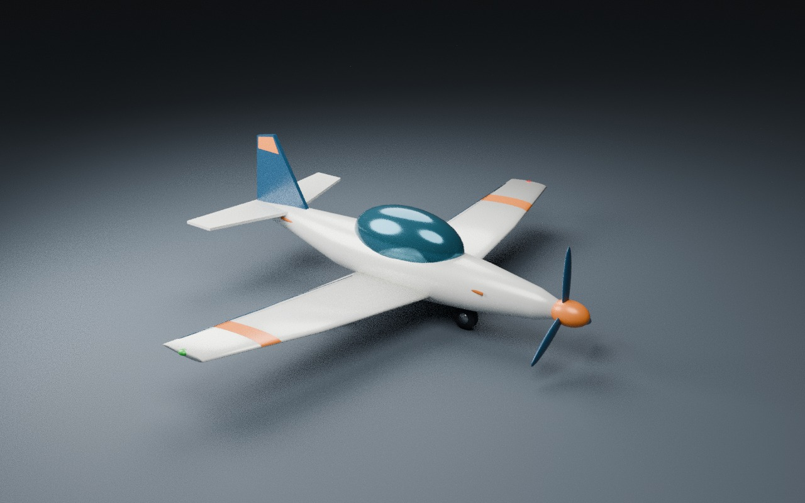
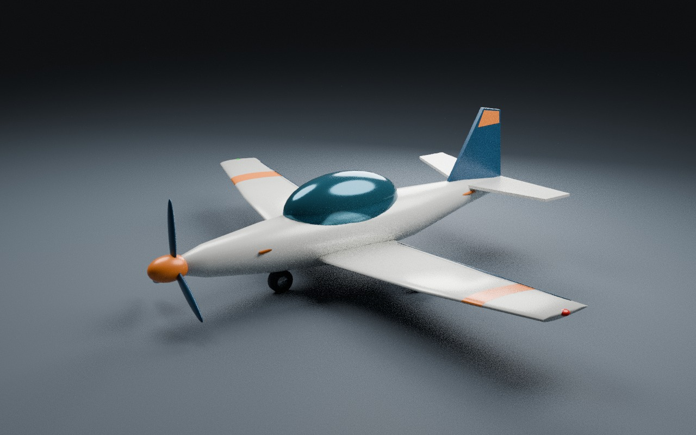

# Aircraft definitions and original Swift Sport assets

This component supplies a validated, serializable FDM definition and two bundled
JSON profiles. Application selection, control/camera setup, approach initialization
and replay compatibility checks are supplied by the separate app integration.
Neither generic aircraft is certified real-aircraft performance data.

JSON parsing rejects unknown fields. `AircraftDefinition::to_config` rejects
nonfinite or out-of-range physical parameters, indefinite inertia tensors,
unsupported stability signs and negative flap lift/drag before calling
assertion-based constructors.
Raw SI values are confined to the JSON boundary; the FDM configuration uses the
existing physical-unit types.

## Original model and reproducible source

The original generic Swift Sport was created with Blender 4.3.2. Its GLB, editable
compressed `.blend`, and `tools/blender/build_swift_sport.py` are included under the
repository's MIT OR Apache-2.0 license. No external mesh, texture, logo or branded
aircraft design was downloaded. See [attribution](../../ATTRIBUTION.md).

```sh
blender --background --threads 2 --python tools/blender/build_swift_sport.py -- assets/aircraft
```

These are actual Cycles CPU studio renders of the supplied asset, not screenshots
of the simulator. Both views were inspected. The conforming orange wing bands,
fixed landing gear, canopy, propeller and navigation lights are visible.




## Component validation

- JSON definitions convert to valid FDM configurations; Light Single preserves the
  legacy built-in dynamics, while Swift Sport changes mass, inertia, wing area,
  power and roll response
- Invalid dynamics domains and unknown fields are rejected; serialization restores
  an identical 1,200-step reference trajectory
- GLB header/chunk length and embedded buffers were checked: glTF 2.0, 229,192 bytes,
  31 meshes, with no external buffer dependencies
- GLB SHA-256: `9f30f6f9babe87a54d0f1f5da104f719d7e99cb05aada2848f8ea88b0bf9e3b1`
- Editable Blender file SHA-256:
  `29a25578733be83d25ccff12c117b29124b57b5e69e8356bd8189d128e514e77`

```sh
cargo test --locked -p flightsim-fdm --all-targets
cargo clippy --locked -p flightsim-fdm --all-targets -- -D warnings
```

This component does not establish application startup/reset behavior, hardware GPU
compatibility, physical-controller handling or real-world aircraft fidelity.
