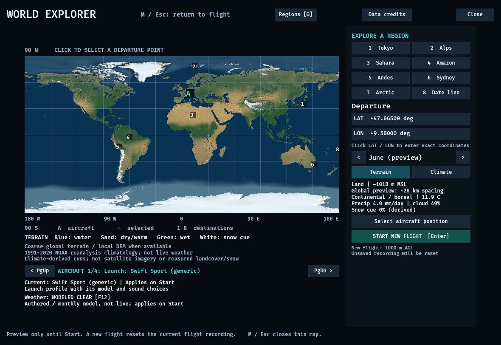
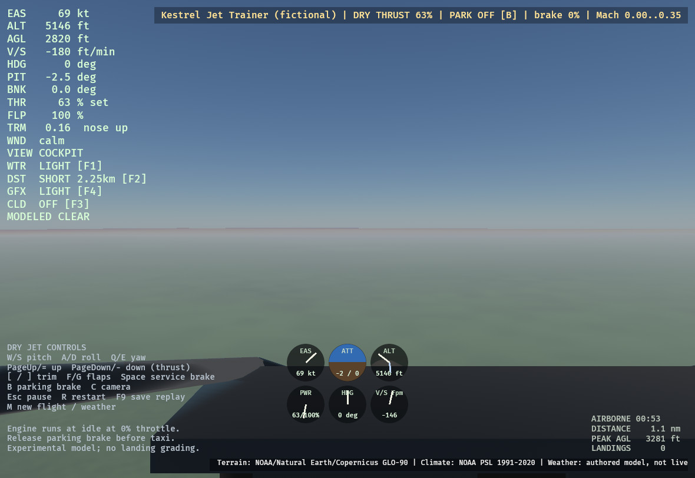
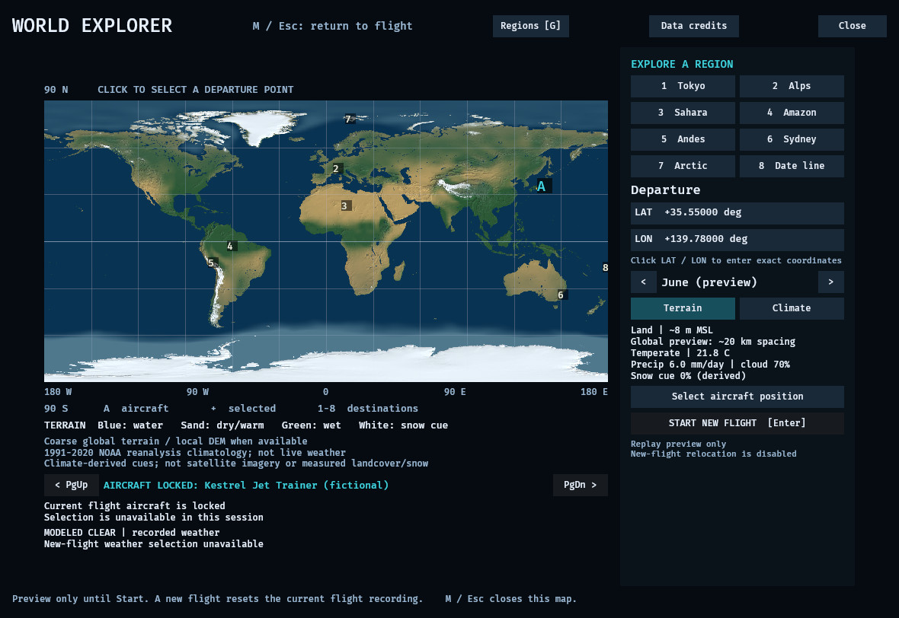

# Aircraft selection: native verification (2026-10-04)

Final production source `7a955b75f2845e9da5c818be4b2113b476a3f2b1` passed the
bounded native checks below. The candidate binding is reviewed at `e392e046`.
Source CI and Windows/distribution gates are reported separately.

The actual Linux desktop app changed from Swift Sport to Kestrel Jet Trainer,
then Meadow Trainer, then Swift Sport without restarting. Each explicit Start
replaced the model and flight together. Preview cancellation preserved the old
flight; canceling a preview opened from paused Meadow restored that paused flight.
The process exited normally with code 0.

## Native lifecycle and controls

This first pass used production source `1ce3fa723d4a0b69737e372df49414adad480a78`
and native binary SHA-256
`e695db07f54ef73de254ba98f32a09bf11315221a9db96ec8ee9daeb9da23f84`.
It ran at 1180×812, with Light graphics/water, Short distance, clouds Off,
authored Clear weather, calm wind and global terrain at 35.55°N,139.78°E.

- A Kestrel preview left the parked Swift at 0 kt, 146 ft MSL/3 ft AGL,
  zero throttle and .08 trim. Close canceled it; reopening selected the active
  Launch entry rather than the canceled preview.
- Starting Kestrel displayed preparation, then its original exterior, dry-jet
  controls and authored Mach 0–0.35 range. Actual keyboard input changed thrust
  from 39.16% to 64.16%, with a bounded pitch response. The active map identity
  changed only after the flight committed.
- Starting Meadow restored its high-wing exterior, cockpit, legacy controls,
  .09 trim, 65% throttle and zero flaps. Keyboard pitch/throttle input responded;
  the authentic recording contains throttle down to 47.92%. Its dynamics remain
  the unchanged Light Single model.
- Starting Swift restored its low-wing exterior, .08 trim and legacy controls.
  The flight clock, recording and displayed aircraft identity reset again.
- There was no visible duplicate aircraft, blank scene, stale jet banner in the
  propeller flight or application crash. Light retained one flight-camera owner,
  active outside the map, and no environment-lighting helper owners in sampled logs.

A rapid Start/Close attempt finished loading Meadow before Close reached it;
that observation does not establish cancellation during admitted preparation.
Real-loader/ECS tests separately exercise cancellation at different loading stages.

## Authentic recording reproduction

F9 saved three unmodified native recordings after the switches:

| Aircraft | Format | Fixed steps | Duration (s) | Exact native checkpoints |
|---|---|---:|---:|---:|
| Kestrel | v4 | 3,320 | 27.666666666665737 | 28 |
| Meadow | v3 | 1,205 | 10.041666666666737 | 11 |
| Swift | v3 | 5,485 | 45.708333333331382 | 46 |

Two source-backed reexecutions of each recording match all 13 physical state
components bit for bit at every recorded checkpoint. The complete per-step traces
also match between reexecutions. Exact codec round trips preserve each original
file. Wrong Swift/Meadow physics, the wrong jet profile and cross-family readers
all reject the input.

Kestrel's mandatory final native state matches exactly. V3 has no mandatory final
native checkpoint: the final 5 Meadow and 85 Swift steps demonstrate repeat-run
determinism, not a comparison with an unrecorded native state.

## Final polished native cases

The final binary is **150,341,976 bytes**, SHA-256
`fb271f62aa220b3370840197342b63d2b1c62a2f571decb73c272de25e723bbd`.
It was built with Rust 1.93, default features, locked dependencies and the same
configured development profile; no `commercial-staging` or `region-downloads`.
The final changes from the first native pass are presentation text and tests.

- **Case25, regional rejection/recovery:** selecting the prepared Liechtenstein
  package and starting Kestrel shows the complete regional-terrain rejection.
  Swift stays active and the chosen package remains selected. Explicitly choosing
  Base in Regions and pressing a new Start then commits Kestrel. Both preparation
  lines, the correct cockpit, jet help and actual thrust 39→63% response were visible.
- **Case26, map:** complete Launch/Swift name, one Current prefix, full description
  and controls are visible at 1180×812. This capture shows the unchanged active
  Swift and the new four-choice picker, before Start.
- **Case27, authentic replay:** loading the unmodified case24 jet recording shows
  the complete locked Kestrel name, disabled new-flight action and recorded-weather
  status. Automated tests separately exercise rejected edit/Start actions.
- All three processes exited normally with code 0; the original PNGs were inspected.
  Real-font automated bounds checks additionally cover 1024×720 and 1280×720.
  Native viewport coverage is 1180×812; other sizes have automated coverage only.

These are compact JPEG illustrations at the original 1180×812 dimensions. The
unaltered PNGs, command/source/binary receipts and runtime logs are retained in
the QA archive. Their SHA-256 values are:

| Case | Original PNG SHA-256 |
|---|---|
|25|`7075349bb167bc06cdb94147fbcdba012be364c667c478d8340bb5fb9bf1f984`|
|26|`9fd34fae5fda720dd4b6d0b332babd608300502295386c343054608cf8214cd2`|
|27|`b71049e895dbd49df7e97c8736ab47a20f7fbdbaa53ede3ea354df3175c6ff89`|

The independently reviewed binding retains all 13 historical anchors, advances
nine existing source pins and adds five transaction/scene/audio ownership pins
(41 total). Its 172 Python contract tests and exact source/export validation pass.
See [binding review](replay-candidate-picker-pin-review-2026-10-04.md) and
[split automated suites](aircraft-picker-automated-2026-10-04.md).

## Limits

These are bounded native transaction/control checks and exact numerical replay
checks, not full handling or envelope qualification. Map starts remain 1,000 m AGL
and need continued pilot control. The environment uses CPU llvmpipe; no hardware
GPU FPS or memory claim is made. No output audio device was present; audio source
ownership/muting is covered by automated tests, with no speaker-listening claim.

All four runtime logs contain zero ERROR lines. Case24 contains 49 Bevy B0004
insertion-time warnings while Kestrel/Meadow mesh children are created; final
cases25,26 and27 contain 46, 0 and 46 respectively. Separate real-loader
tests verify the completed parent/transform/visibility hierarchy. This report
does not claim warning-free loading.

Source CI, Windows extracted-candidate rendering and distribution authorization
remain separate gates. The current Windows software-D3D12 full-scene capture
still exceeds its 180 s watchdog, and dependency/rights review remains open.
