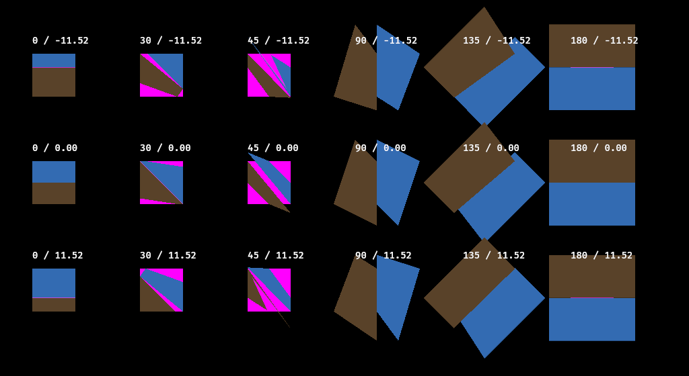
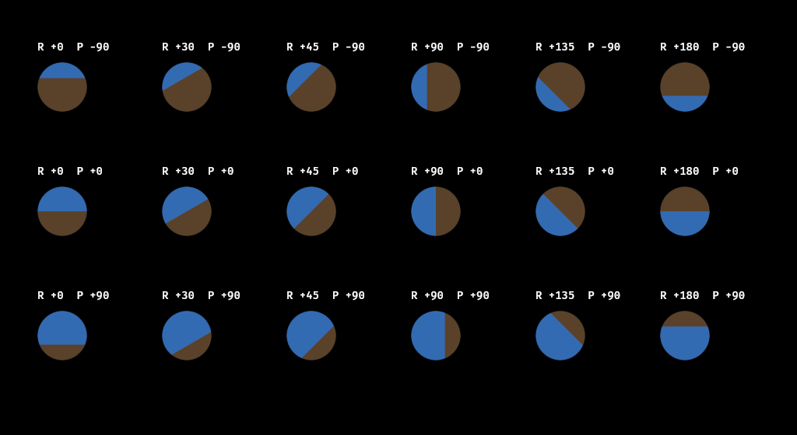
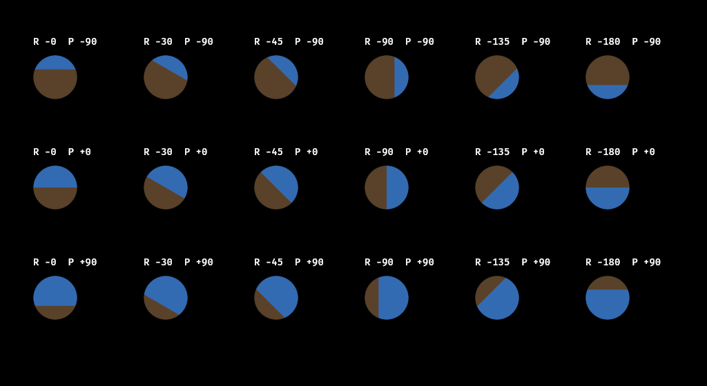

# Attitude indicator clipping regression

Issue [#33](https://github.com/Xenoah/flightsim-claude/issues/33).

The original oversized rotated UI children leaked outside their intended dial bounds
because Bevy 0.18.1 clips those quads as axis-aligned geometry. The before image is an
actual software-rendered Bevy reproduction, not a mockup. Its labels show old bank /
pixel-offset values; 85,024 classified sky/ground pixels lay outside the square bounds.



The production fix uses a stationary dial-sized material quad. An analytic sky/ground
boundary rotates inside it; an analytic circular alpha mask forms the round aperture.
All six instruments now have a round bezel. The numeric attitude remains visible;
pitch display saturation at ±30 degrees is preserved from the existing instrument.

These are actual renders of the production material at pitch −90/0/+90 degrees and
bank 0/30/45/90/135/180 degrees, mirrored for negative banks. Across 36 cases, the pixel
checker found zero classified sky/ground pixels outside the circular aperture, with
2,931–3,012 classified interior pixels per dial. CPU raster output is checked with
an explicit small antialiasing boundary tolerance; this is not a claim every GPU or
DPI configuration has been tested.




Reproduce:

```sh
cargo run -p flightsim-ui --example attitude_clip_repro -- before.png
python3 crates/flightsim-ui/examples/check_attitude_pixels.py before.png --shape square --expect-leaks
cargo run -p flightsim-ui --example attitude_matrix -- positive.png
cargo run -p flightsim-ui --example attitude_matrix -- negative.png --negative-bank
python3 crates/flightsim-ui/examples/check_attitude_pixels.py positive.png --shape circle
python3 crates/flightsim-ui/examples/check_attitude_pixels.py negative.png --shape circle
```

The pure geometry tests check bank sign, finite bounds and pitch saturation. Actual
application cockpit captures additionally exercise plugin/shader integration. No FDM,
input mapping, new dependency or rendering-layer boundary changes are needed for this fix.
