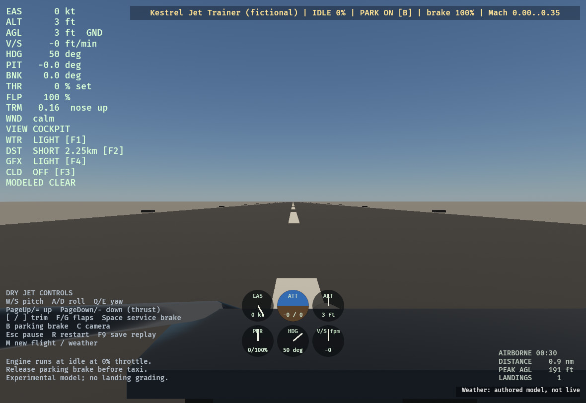
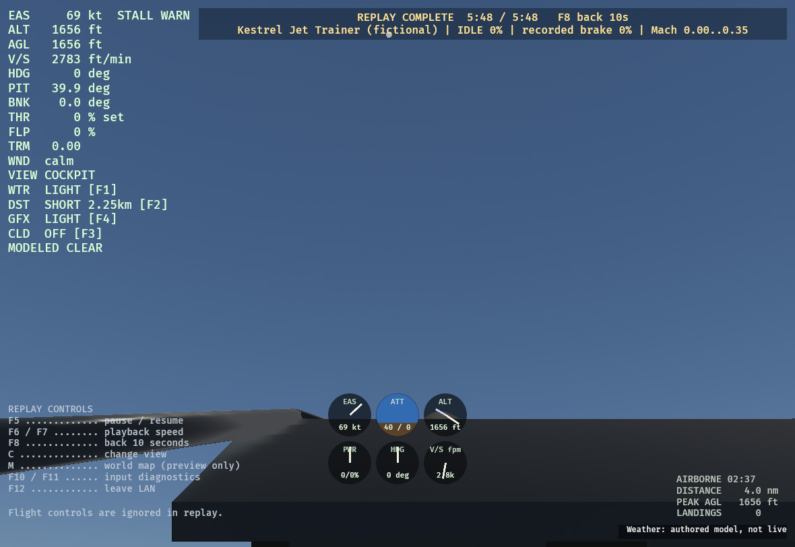
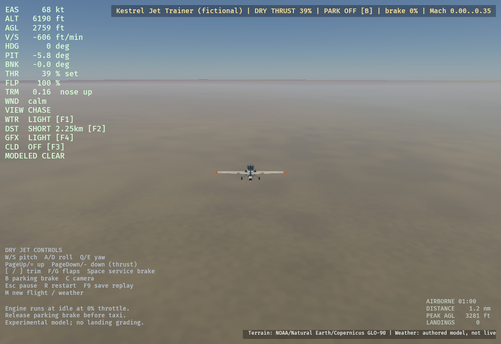

# Kestrel native flight and lifecycle checks — 2026-10-04

The original fictional Kestrel loaded and flew in the actual native application.
Manual keyboard takeoff, release of the controls, cruise adjustment, deliberate
stall warning/recovery response, approach/contact, braking, recording, restart,
map transition and replay were exercised on the cloud Linux desktop. This is
bounded development acceptance for an opt-in provisional profile, not real-jet
handling fidelity, a certified envelope, a full flight test or Windows qualification.

The renderer was CPU llvmpipe/Vulkan. No audio device was available, so speaker
listening was not performed. Timings included pauses and concurrent compilation;
they are not a hardware-GPU performance benchmark. The GLB and profile remained
byte-identical throughout these checks. ModelFit reported 8.50 m and scale 1.0000.

## Actual manual flight

The control case used explicit flat-zero terrain, ISA, calm wind/turbulence,
authored Clear weather, Light graphics/water, Short distance and clouds Off.
All flight inputs came through the native keyboard interface; no trajectory
assignment, takeoff driver or hidden stabilizer was used.

- B released the parking latch; equals/minus used the existing throttle bindings
- Full dry thrust, 25% flaps and a short S input produced 90 kt / 16 ft AGL and
  positive climb; after releasing the controls it continued to 378 ft, then 1067 ft
- Manual thrust/trim changes reached an observed 108 kt, 1309 ft, pitch 1.7 degrees
  and displayed vertical speed −51 ft/min at 45% thrust and 0.02 trim
- Idle and a deliberate sustained S input produced STALL WARN around 70 kt and
  1650 ft; W plus thrust cleared it, followed by an S pullout into positive climb
- The recovery included substantial pilot-induced pitch/vertical excursions.
  This is warning/control-response evidence, not benign or hands-off stall recovery
- Chase, free, tower and cockpit views were selected; cockpit forward sightlines
  were clear and the unrelated legacy propeller interior was absent. Distant
  free/tower observations do not establish fine mesh quality

Two successive F9 snapshots preserved 35,422 and 48,448 actual committed steps.
Both reproduced exactly with the independently built headless v4 player.
Their respective durations were 295.183333333229 and 403.733333333130 seconds.

## Approach, braking and reset

An actual synthetic-runway approach started 0.6 nautical miles out. At 68 kt,
70 ft AGL and −385 ft/min, bounded S inputs raised pitch and minus reduced thrust
to idle. Contact registered at approximately 3 ft CG height with one landing
counted. Space braking followed by B stopped the aircraft at 0 kt with parking
ON. This is one observed contact/braking case; no jet landing grade is assigned.
The saved 6232-step / 51.933333333331-second recording also reproduced exactly.

R followed immediately by pause restored the approach state, cleared the flight
log, and showed −357 ft/min in the HUD versus −356 in the cockpit gauge. A repeated
restart succeeded. Map Start then committed a new 1000 m AGL flight. A separate
pause/map/weather-preview/Cancel check retained the prior flight and Clear weather.

The first manual run exposed stale smoothed vertical speed after reconstruction.
The correction explicitly reseeds jet instruments on first publication, restart,
map commit and each bounded seek update. Ordinary live and legacy smoothing keep
their previous behavior; no velocity-jump heuristic changes the flight model.

## Replay warning and interruption

A 349-second prefix retained the original recording header, controls and authentic
checkpoints. It was independently replayed before native use; no state or control
was rewritten. In the final native build it played at 8×, reached the recorded
stall, rewound ten seconds through bounded reconstruction, paused, ignored a live
throttle input, resumed and completed again. During paused rewind, HUD and gauge
both displayed 747 ft/min. The app then saved its screenshot and exited with zero.

Native QA found two separate warning presentation defects, both corrected:
the fixed banner inset overlapped STALL WARN, and replay audio-mute state erased
a valid visual warning at pause/completion. The measured flex layout now reserves
HUD width; visual validity is independent of audio transport muting. Terminal,
reproduction-fault, invalid-state and low-speed guards remain. Real-font layout
tests also cover desktop sizes and wrapping at narrow widths. At 320×480 the
warning is protected, but the complete desktop UI does not fit vertically.

## Global terrain and scene completeness

A separate live chase-view case started 1000 m above the bundled coarse global
surface near the Alps, with climate colors disabled to isolate geometry. The
capture is visibly coarse: this is approximately 20 km source terrain, without
regional DEM or scenery. Final streaming diagnostics showed 41 displayed/live
tiles, 96 visible seam bridges and matching desired/displayed sets. It exited
cleanly after capture. Regional packages/raw tiles remain explicitly unsupported
for jet physical sessions and are not silently substituted.

Kestrel emitted 46 Bevy B0004 insertion warnings. A separate real-loader test
exhaustively verified all 107 scene entities / 53 meshes and all parent components,
transforms, materials, bounds and ancestor visibility propagation. Swift's 63
entities / 31 meshes passed the same checks without warnings. See the
[scene-hierarchy evidence](aircraft-scene-hierarchy-2026-10-04.md); this supports an
insertion-order explanation, not a claim that arbitrary B0004 warnings are harmless.

## Evidence identity and limits

Manual flight used source `238e89b`; approach/reset/global cases used `dd42b3d`.
Final warning/replay source was `138e317e199b6bda8108b1ce1a7c7b48ab70461c`, with
immutable executable SHA-256
`6fb2e8584da6c926cef7b5729cfc980698d254c1fd01d5aacee46139c0a77362`.
Original full-resolution PNGs, exact recordings, logs and command/exit receipts
are retained in the development evidence archive. The inline JPEGs are size-reduced
copies of those actual app captures, not rendered asset previews or mockups.

Original PNG SHA-256 values:

- Landing: `766b7a211e725c3df821a3cedf5f3a8a649675bef40551b971802daecb510e3c`
- Global: `16836e85cd11f86352d1d8bce8f681af6dac371864df8f1b2b8d058f7ce082ff`
- Stall replay: `f2f5cb1132f2c1a99f9bf52330ea016da566cbd3e03653ea8123eb7469a0d2c2`

The source-only milestone does not clear dependency/asset review or the separate
Windows full-scene screenshot gate. No binary release or commercial clearance is
implied. The profile remains fictional and provisional, limited to its explicit
pressure/temperature/Mach box; no spool, fuel, retractable gear, afterburner,
high-speed fighter behavior or live-weather coupling is modeled.
