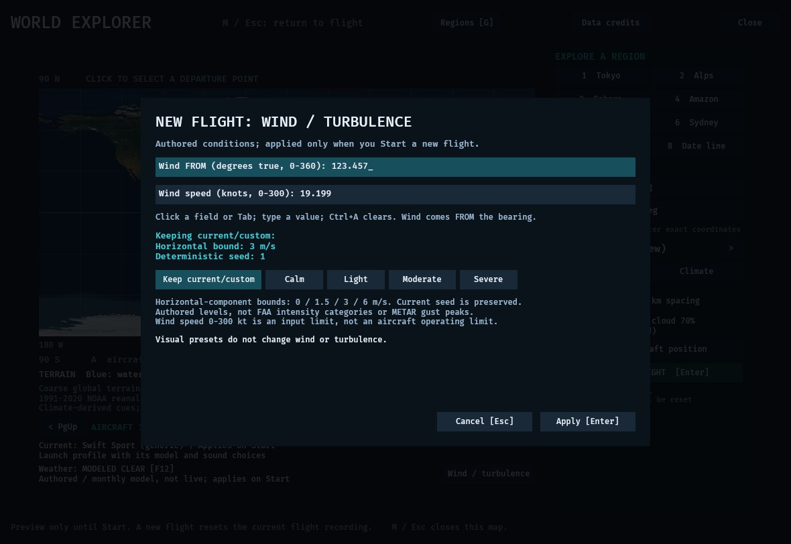
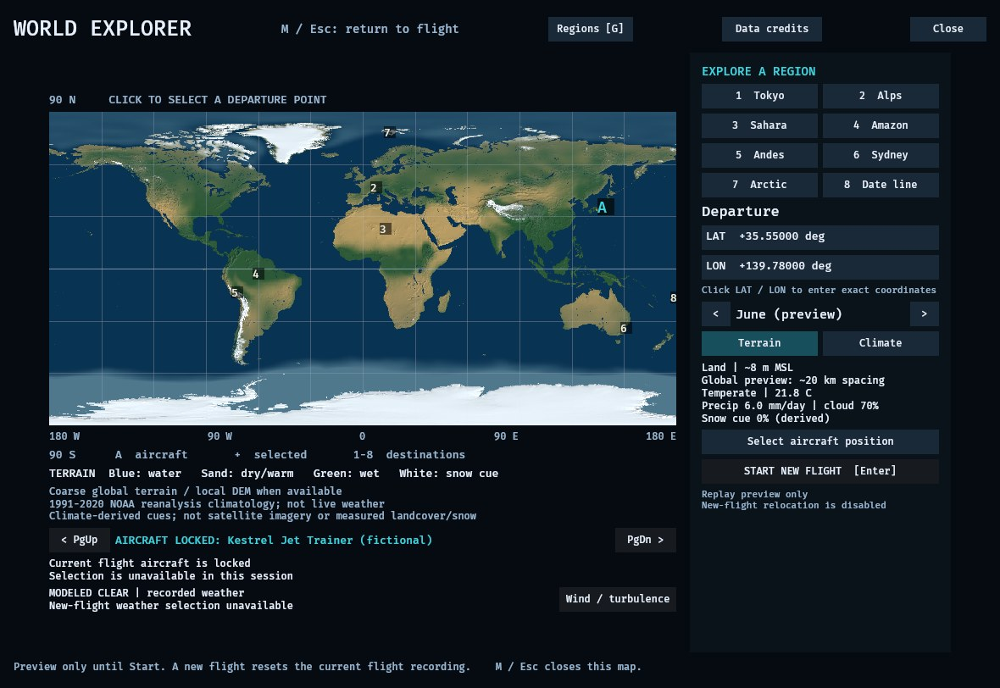

# New-flight wind: native verification (2026-10-04)

The new map editor passed bounded native input, cancellation, explicit Start,
aircraft-switch and authentic replay checks. Production source is
`bf79f846bdfd8da768306415082960a85616b329`; its default-feature Linux binary is
150,393,248 bytes, SHA-256
`c72891b2aaea8a6ef4c1927d1866875dd52ad2535834fd20dfd7f4d9bd6b0c0a`.
Source CI, Windows rendering and distribution authorization remain separate gates.

## Editor and flight transaction

The actual app ran at 1180×812, Light graphics/water, Short distance, clouds Off,
authored Clear weather and global terrain at 35.55°N, 139.78°E. Native checks used
mouse buttons, Ctrl+A/text/Tab and keyboard controls through the desktop.

- Entering 270°/12 kt and Light turbulence, then canceling both editor and map,
  retained the parked Swift at 0 kt with calm wind. Reopening showed the original
  conditions, rather than the discarded draft.
- Entering 301 kt displayed the 0–300 kt validation message and retained the
  editor. It did not start a flight. This is a software input bound, not an
  aircraft operating envelope.
- Correcting the speed and applying returned to the map without launching.
  A separate explicit Start committed Swift with the selected 270°/12 kt wind
  and Light turbulence (1.5 m/s horizontal bound, seed 0).
- During paused flight, canceling a subsequent 90° draft retained the same
  flight. F9 recordings immediately before and after cancellation were
  byte-identical, including controls, checkpoints and environment.
- Starting Kestrel and then restarting it retained those physical conditions.
  The correct jet model, controls, identity and actual thrust/pitch response were
  visible. Restart advances the visual epoch by elapsed flight time; this is not
  a claim that the entire environment block remains identical.

The first pass used source `fe6f0aef233e65287c58a8403e33cba5268d9d34`, binary
`ee42e451ab5eb0219f3d80a5b23d3936f988f3c73fe84df2f7f4193c73b3ef16`.
It exposed a clipped explanatory footer. The final source shortens that string
and adds an assertion that its complete rendered text survives the character
limit. Conditions, transaction logic and physics are unchanged. The final native
capture confirms the full note is visible.

## Exact retained precision

The final app launched with 123.456789° true / 19.198765 kt and Moderate
turbulence (3 m/s horizontal bound, seed 1). The editor displays three decimals.
Selecting only Calm, without editing either numeric field, then Apply and a
separate Start preserved the original direction/speed bits exactly:

| Field | Before and after |
|---|---|
| Wind-from radians | `2.1547274519899178`, bits `40013ce1bf10b88a` |
| Speed m/s | `9.876697994444447`, bits `4023c0de8f3d3723` |
| Turbulence seed | `1` |

Only the selected turbulence amplitude changed 3→0. The saved values differ from
parsing the rounded 123.457°/19.199 kt display. The explicit map Start also applies
its epoch/climate settings, so whole-environment equality is not claimed.

## Authentic recording and replay checks

Six unmodified native F9 files were decoded and executed twice by a separately
built source-backed harness, with independent wire/fingerprint inspection.

| Recording | Aircraft / format | Fixed steps | Native checkpoints | Uncheckpointed v3 tail |
|---|---|---:|---:|---:|
|001 / 002, canceled draft pair|Swift / v3|4,548 each|38 each|108 each|
|003, switched aircraft|Kestrel / v4|5,839|49|not applicable|
|004, restart|Kestrel / v4|2,247|19|not applicable|
|005, precise CLI baseline|Swift / v3|9,638|81|38|
|006, strength-only edit|Swift / v3|1,876|16|76|

Every recorded native checkpoint matches all 13 rigid-body f64 state components
bit for bit. Complete traces match between the two reexecutions. V4 final states
match native finals; v3 tails only establish repeated-run equality because v3
has no mandatory final native checkpoint. Codec round trips preserve every
original byte. Wrong profiles and cross-family readers reject the recordings.

The final native app also loaded recording 003. It showed the correct Kestrel
and 270°/12 kt HUD wind. In its map, clicking Wind / turbulence, Enter and F12 did
not open the editor, start a flight or change recorded weather. Returning to
playback and F8 rewind retained the recorded wind and resumed playback.

The illustrations are JPEG encodings at the original 1180×812 dimensions.
Unmodified PNGs and command/source/binary receipts are retained in the QA archive:

| Case | Original PNG SHA-256 |
|---|---|
|29, final editor|`818985ba8c4aff138a9c4bf185d4f34a14fa3a25ff7b9e9c9c79d93ef62732dd`|
|31, replay lock|`ef723a59fb3db7daca289d1e8c3ac8b8c06929bf56cd3c92dc413201b5dffdab`|

## Scope and limitations

Native cases 28, 29 and 31 exited normally with code 0 and contain no ERROR
lines. They contain 46, 0 and 46 Bevy B0004 insertion-time warnings respectively;
the separately tested completed GLB hierarchy is not a warning-free claim.
Case 30 used an unsupported CLI alias, exited 2 before app startup and receives
no native acceptance credit; case 31 uses the actual JSON profile.

These checks use CPU llvmpipe and no output audio device. They establish editor
and replay behavior, not hardware GPU performance, speaker output or certified
handling. Automated real-font layouts cover 1024×720 and 1280×720; native checks
cover only 1180×812. Stale-load cancellation and exact failed-load rollback are
covered by the [automated transaction checks](new-flight-wind-controls-2026-10-04.md).

The [candidate binding review](replay-candidate-wind-pin-review-2026-10-04.md)
retains 13 historical anchors, checks 47 source pins and passes 174 Python tests.
No dependency or rights gate is relaxed. The accepted predecessor's Windows
software-D3D12 full-scene capture still reaches its unchanged 180 s watchdog;
there is no Windows rendering qualification or new binary release claim here.
